----------
#### STM32标准库工程模板创建 ####

2019/5/12 14 :31 :26 

Author :terrycoder 

----------

#### 移植环境 ####

1. **本文所使用的移植环境如下：**

	- 硬件环境为：STM32F103ZET6
	- 软件环境为： MDK5.23

#### 开始移植 ####

1. 为了工程目录更加清晰，我们在本地电脑上新建一个“工程模板”文件夹，在它之下
再新建 6 个文件夹，具体如下：

| 名称 | 作用 |
| :----: | :----- |
| Doc | 用来存放程序说明的文件，由写程序的人添加 |
| Libraries | 存放的是库文件 |
| Listing |存放编译器编译时候产生的 C/汇编/链接的列表清单 |
| Output | 存放编译产生的调试信息、 hex 文件、预览信息、封装库等 |
| Project | 用来存放工程 |
| User | 用户编写的驱动文件|

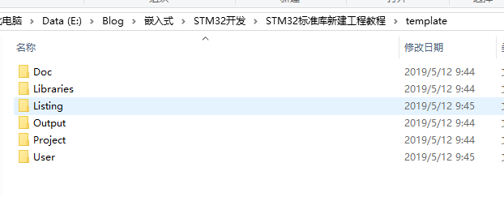

在本地新建好文件夹后，把准备好的库文件添加到相应的文件夹下：

| 名称 | 作用 |
| :----: | :----- |
| Doc | 工程说明.txt |
| Libraries | CMSIS：里面放着跟 CM3 内核有关的库文件 
| Libraries | STM32F10x_StdPeriph_Driver： STM32 外设库文件 |
| Listing | 暂时为空 |
|Output | 暂时为空 |
|Project | 暂时为空 |
| User |stm32f10x_conf.h：用来配置库的头文件|
| User |  main.c： main 函数文件 |
| User | stm32f10x_it.h stm32f10x_it.c：中断相关的函数都在这个文件编写，暂时为空 |

####  新建工程 ####

打开 KEIL5，新建一个工程，工程名根据喜好命名，我这里取 Template（中文是模版的意思） ，保存在 Project\RVMDK（uv5）文件夹下。

 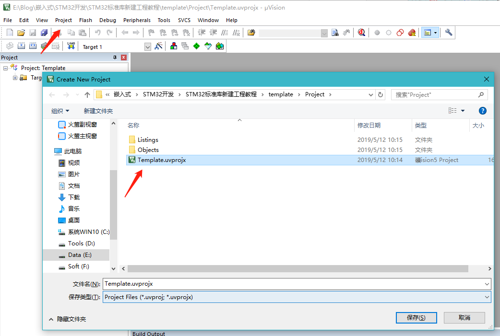
 
1. 选择 CPU 型号
这个根据你开发板使用的 CPU具体的型号来选择， M3旗舰版选 STM32F103ZE型号。
如果这里没有出现你想要的 CPU 型号，或者一个型号都没有，那么肯定是你的 KEIL5 没有
添加 device 库， KEIL5 不像 KEIL4 那样自带了很多 MCU 的型号， KEIL5 需要自己添加，

 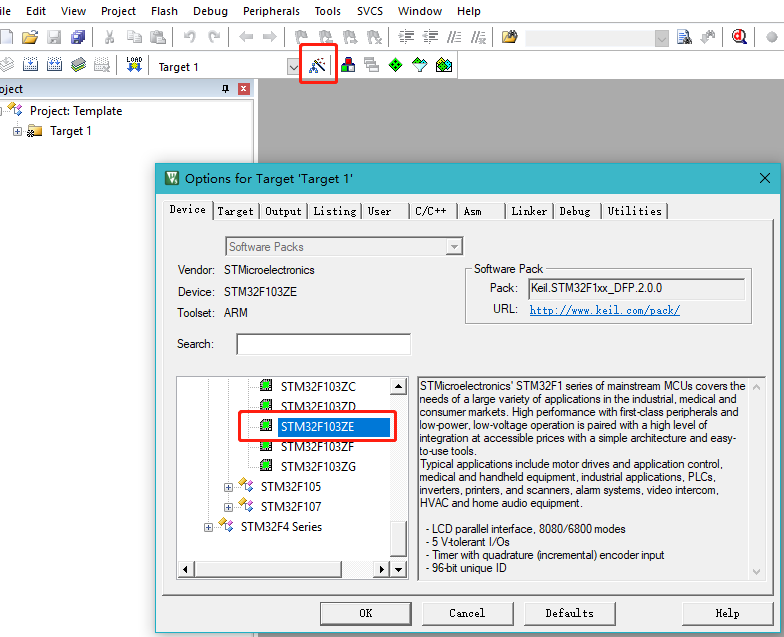
 
2. 在线添加库文件
等下我们手动本地添加库文件，这里我们点击关掉在线添加，因为 keil 的服务器在国外，在线添加会非常慢。

 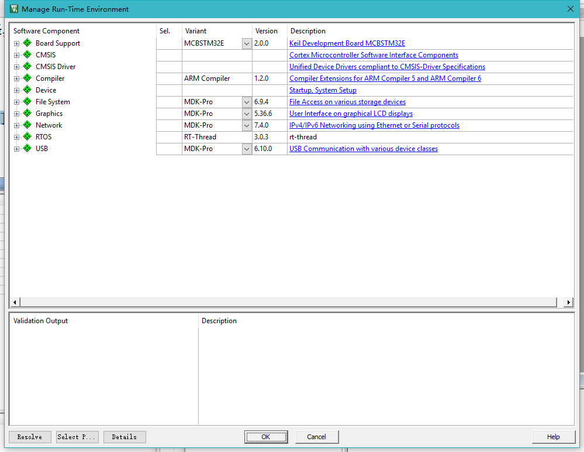
 
3. 添加组文件夹
在新建的工程中添加 5 个组文件夹，用来存放各种不同的文件，文件从本地建好的工程文件夹下获取，双击组文件夹就会出现添加文件的路径，然后选择文件即可。

 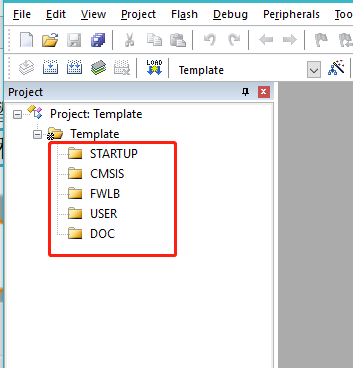

| 名称 | 存放的文件 |
| :---: | :----- |
| STARTUP | startup_stm32f10x_hd.s
| CMSIS | core_cm3.c、 system_stm32f10x.c
| FWLB | STM32F10x_StdPeriph_Driver\src 文件夹下的全部 C 文件，即固件库 |
| USER  | 用户编写的文件：main.c： main 函数文件，暂时为空 stm32f10x_it.c：跟中断有关的函数都放这个文件，暂时为空 |
| DOC  |Readme.txt：程序说明文件，用于说明程序的功能和注意事项等 |

头文件路径

| 文件名  |文件路径 | 放置路径 |
| :--- | :----- | :----|
|stm32f10x_conf.h、stm32f10x_it.c、stm32f10x_it.h | STM32F10x_StdPeriph_Lib_V3.5.0\Project\STM32F10x_StdPeriph_Template | \template\User |
| core_cm3.c、core_cm3.c | Libraries\CMSIS\CM3\CoreSupport | \Libraries\CMSIS |
| system_stm32f10x.c、system_stm32f10x.h、stm32f10x.h 和startup文件夹 |\Libraries\CMSIS\CM3\DeviceSupport\ST\STM32F10x  | \Libraries\CMSIS|

 
4.添加文件
先把上面提到的文件从 ST标准库中复制到工程模版对应文件夹的目录下，然后在新建的工程中添加这些文件，双击组文件夹就会出现添加文件的路径，然后选择文件即可。

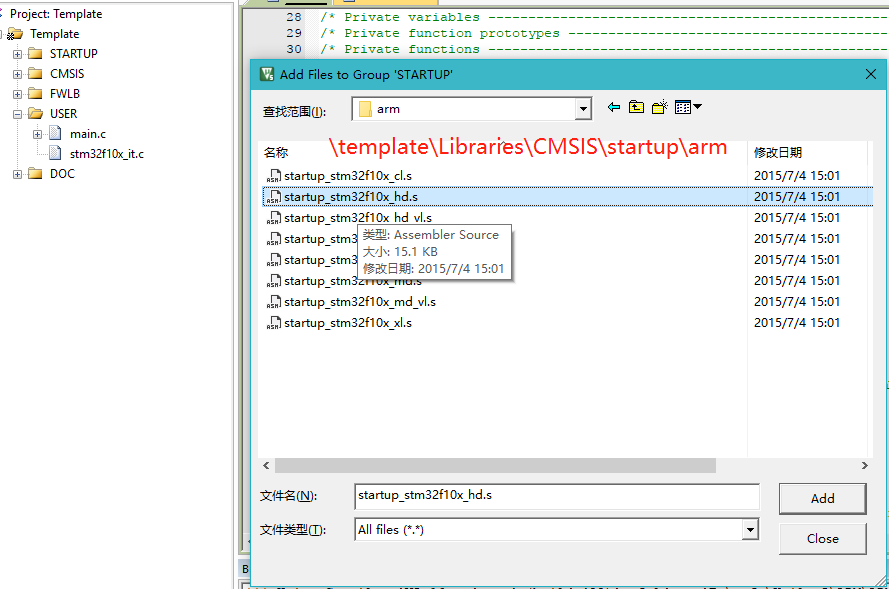

5.配置魔术棒选项卡

1. Target 中选中微库“Use MicroLib”，为的是在日后编写串口驱动的时候可以使用printf 函数。

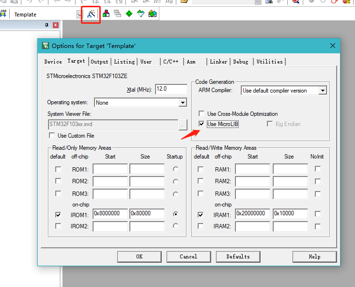

2.  在 Output 选项卡中把输出文件夹定位到我们工程目录下的“output”文件夹，如果想在编译的过程中生成 hex 文件，那么那 Create HEX File 选项勾上。

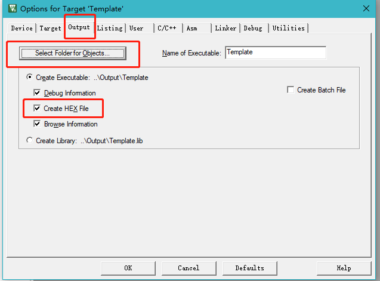

3.  在 Listing 选项卡中把输出文件夹定位到我们工程目录下的“Listing”文件夹。 

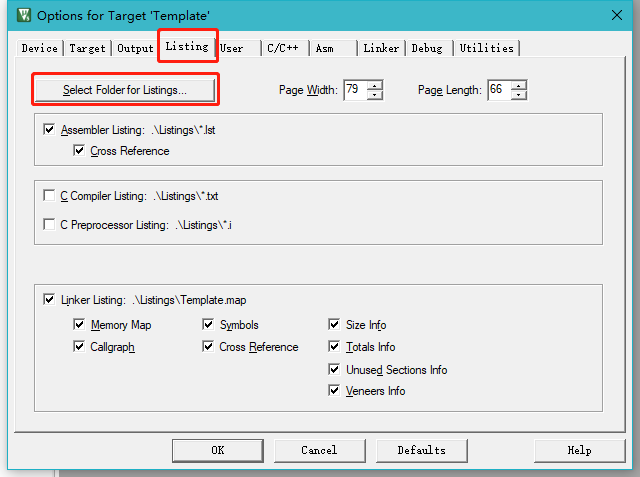

4.  在 C/C++选项卡中添加处理宏及编译器编译的时候查找的头文件路径。如果头文件路径添加有误，则编译的时候会报错找不到头文件。

在这个选项中添加宏，就相当于我们在文件中使用“#define”语句定义宏一样。在编译器中添加宏的好处就是，只要用了这个模版，就不用源文件中修改代码
1. STM32F10X_HD 宏：为了告诉 STM32 标准库，我们使用的芯片类型是 STM32 型号是大容量的，使 STM32 标准库根据我们选定的芯片型号来配置。
2. USE_STDPERIPH_DRIVER 宏：为了让 stm32f10x.h 包含 stm32f10x_conf.h 这个头文件。

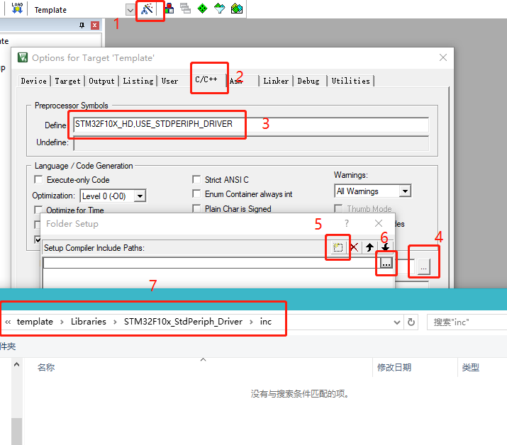

“Include Paths ”这里添加的是头文件的路径，如果编译的时候提示说找不到头文件，一般就是这里配置出了问题。你把头文件放到了哪个文件夹，就把该文件夹添加到这里即可。 (请使用图中的方法用文件浏览器去添加路径，不要直接手打路径，容易出错)

6.仿真器配置

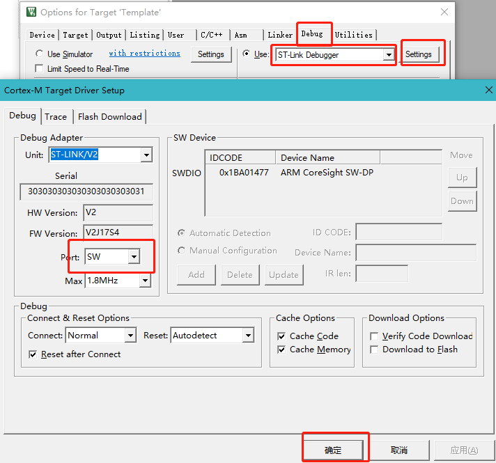

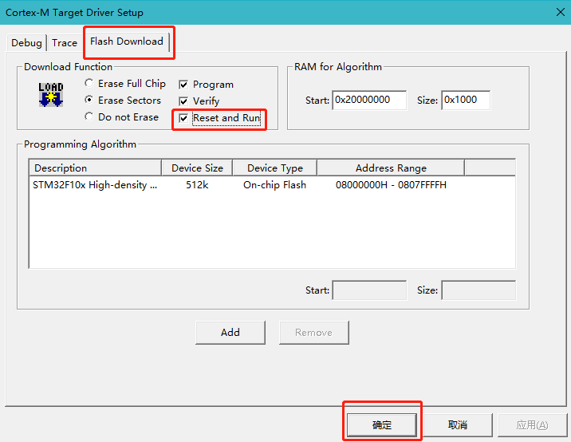

删除main.c中多余的代码，编译工程，一个新的工程模版创建完毕。

