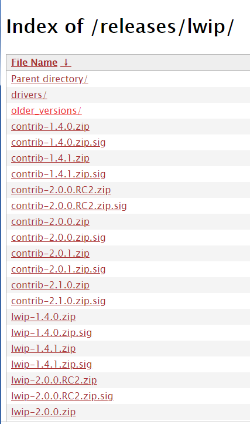
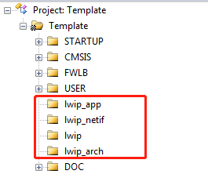
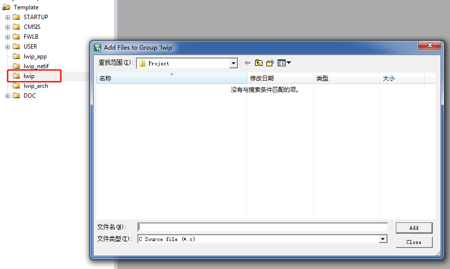
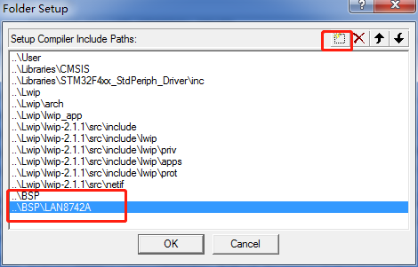
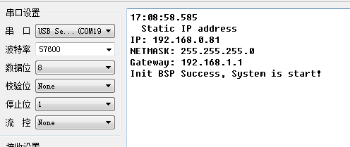
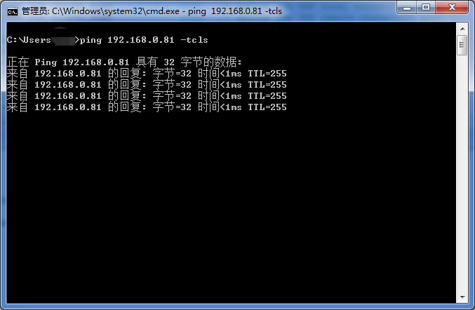

----------

#### LWIP 裸机移植教程 ####

5/13/2019 4 :10 :31 PM 

Author :terrycoder 

----------

#### 硬件环境 ####

MCU：STM32F407，PHY芯片为：LAN8720A

#### 准备工作 ####

下载LWIP源码，下载地址为：[http://download.savannah.nongnu.org/releases/lwip/]()

下载最新源码包和示例压缩包：

这里需要一个标准的STM32工程模板：关于如何新建标准工程模板，[点击这里](https://github.com/peachzz/Blog/blob/master/%E5%B5%8C%E5%85%A5%E5%BC%8F/STM32%E5%BC%80%E5%8F%91/STM32F407%E6%A0%87%E5%87%86%E5%BA%93%E6%96%B0%E5%BB%BA%E5%B7%A5%E7%A8%8B%E6%95%99%E7%A8%8B/STM32F407%E6%A0%87%E5%87%86%E5%BA%93%E6%96%B0%E5%BB%BA%E5%B7%A5%E7%A8%8B%E6%95%99%E7%A8%8B.md)

还需要一款开发板

准备工作到此完成

开始移植

打开模板工程，新建lwip\_app,lwip\_arch,lwip\_netif,lwip分组:

将lwip-2.1.1.zip源码包解压复制到工程模板\template\Lwip文件夹下，（Lwip为新创建的文件夹）

在\template\Lwip路径下新建两个文件夹arch、lwip\_app

向工程中添加源码文件

双击工程中lwip文件夹

分别添加如下路径的源码：

| 路径 | 文件名称 |
| :--- | :--- |
| \template\Lwip\lwip-2.1.1\src\api | 所有文件 |
| \template\Lwip\lwip-2.1.1\src\core | 除了ipv6文件夹外的所有文件 |
| \template\Lwip\lwip-2.1.1\src\netif | ethernet.c |

添加完成后的图片如下：

双击工程中lwip_netif文件夹，添加ethernet.c文件

在\template\Lwip\arch路径下新建cc.h、lwipopts.h、perf.h、sys_arch.c文件

其中cc.h内容为：

	#ifndef __CC_H__
	#define __CC_H__

	#if 0
	#include "cpu.h"
	
	typedef unsigned   char    u8_t;
	typedef signed     char    s8_t;
	typedef unsigned   short   u16_t;
	typedef signed     short   s16_t;
	typedef unsigned   long    u32_t;
	typedef signed     long    s32_t;
	typedef u32_t mem_ptr_t;
	typedef int sys_prot_t;
	
	#endif
	#define U16_F "hu"
	#define S16_F "d"
	#define X16_F "hx"
	#define U32_F "u"
	#define S32_F "d"
	#define X32_F "x"
	#define SZT_F "uz" 
	
	/* define compiler specific symbols */
	#if defined (__ICCARM__)
	
	#define PACK_STRUCT_BEGIN
	#define PACK_STRUCT_STRUCT 
	#define PACK_STRUCT_END
	#define PACK_STRUCT_FIELD(x) x
	#define PACK_STRUCT_USE_INCLUDES
	
	#elif defined (__CC_ARM)
	
	#define PACK_STRUCT_BEGIN __packed
	#define PACK_STRUCT_STRUCT 
	#define PACK_STRUCT_END
	#define PACK_STRUCT_FIELD(x) x
	
	#elif defined (__GNUC__)
	
	#define PACK_STRUCT_BEGIN
	#define PACK_STRUCT_STRUCT __attribute__ ((__packed__))
	#define PACK_STRUCT_END
	#define PACK_STRUCT_FIELD(x) x
	
	#elif defined (__TASKING__)
	
	#define PACK_STRUCT_BEGIN
	#define PACK_STRUCT_STRUCT
	#define PACK_STRUCT_END
	#define PACK_STRUCT_FIELD(x) x
	
	#endif
	
	#define LWIP_PLATFORM_ASSERT(x) //do { if(!(x)) while(1); } while(0)
	
	#endif /* __CC_H__ */

perf.h内容为：

    #ifndef __PERF_H__
	#define __PERF_H__
	
	#define PERF_START    /* null definition */
	#define PERF_STOP(x)  /* null definition */
	
	#endif /* __PERF_H__ */

lwipopts.h内容为：

	#ifndef __LWIPOPTS_H__
	#define __LWIPOPTS_H__
	
	/**
	 * SYS_LIGHTWEIGHT_PROT==1: if you want inter-task protection for certain
	 * critical regions during buffer allocation, deallocation and memory
	 * allocation and deallocation.
	 */
	#define SYS_LIGHTWEIGHT_PROT    0
	
	/**
	 * NO_SYS==1: Provides VERY minimal functionality. Otherwise,
	 * use lwIP facilities.
	 */
	#define NO_SYS                  1
	#define LWIP_IPV4				1
	/**
	 * NO_SYS_NO_TIMERS==1: Drop support for sys_timeout when NO_SYS==1
	 * Mainly for compatibility to old versions.
	 */
	#define NO_SYS_NO_TIMERS        1
	
	/* ---------- Memory options ---------- */
	/* MEM_ALIGNMENT: should be set to the alignment of the CPU for which
	   lwIP is compiled. 4 byte alignment -> define MEM_ALIGNMENT to 4, 2
	   byte alignment -> define MEM_ALIGNMENT to 2. */
	#define MEM_ALIGNMENT           4
	
	/* MEM_SIZE: the size of the heap memory. If the application will send
	a lot of data that needs to be copied, this should be set high. */
	#define MEM_SIZE                (10*1024)
	
	/* MEMP_NUM_PBUF: the number of memp struct pbufs. If the application
	   sends a lot of data out of ROM (or other static memory), this
	   should be set high. */
	#define MEMP_NUM_PBUF           100
	/* MEMP_NUM_UDP_PCB: the number of UDP protocol control blocks. One
	   per active UDP "connection". */
	#define MEMP_NUM_UDP_PCB        6
	/* MEMP_NUM_TCP_PCB: the number of simulatenously active TCP
	   connections. */
	#define MEMP_NUM_TCP_PCB        10
	/* MEMP_NUM_TCP_PCB_LISTEN: the number of listening TCP
	   connections. */
	#define MEMP_NUM_TCP_PCB_LISTEN 6
	/* MEMP_NUM_TCP_SEG: the number of simultaneously queued TCP
	   segments. */
	#define MEMP_NUM_TCP_SEG        12
	/* MEMP_NUM_SYS_TIMEOUT: the number of simulateously active
	   timeouts. */
	#define MEMP_NUM_SYS_TIMEOUT    10
	
	
	/* ---------- Pbuf options ---------- */
	/* PBUF_POOL_SIZE: the number of buffers in the pbuf pool. */
	#define PBUF_POOL_SIZE          20
	
	/* PBUF_POOL_BUFSIZE: the size of each pbuf in the pbuf pool. */
	#define PBUF_POOL_BUFSIZE       500
	
	
	/* ---------- TCP options ---------- */
	#define LWIP_TCP                1
	#define TCP_TTL                 255
	
	/* Controls if TCP should queue segments that arrive out of
	   order. Define to 0 if your device is low on memory. */
	#define TCP_QUEUE_OOSEQ         0
	
	/* TCP Maximum segment size. */
	#define TCP_MSS                 (1500 - 40)/* TCP_MSS = (Ethernet MTU - IP header size - TCP header size) */
	
	/* TCP sender buffer space (bytes). */
	#define TCP_SND_BUF             (4*TCP_MSS)
	
	/*  TCP_SND_QUEUELEN: TCP sender buffer space (pbufs). This must be at least
	  as much as (2 * TCP_SND_BUF/TCP_MSS) for things to work. */
	
	#define TCP_SND_QUEUELEN        (2* TCP_SND_BUF/TCP_MSS)
	
	/* TCP receive window. */
	#define TCP_WND                 (2*TCP_MSS)
	
	
	/* ---------- ICMP options ---------- */
	#define LWIP_ICMP                       1
	
	
	/* ---------- DHCP options ---------- */
	/* Define LWIP_DHCP to 1 if you want DHCP configuration of
	   interfaces. DHCP is not implemented in lwIP 0.5.1, however, so
	   turning this on does currently not work. */
	#define LWIP_DHCP               1
	
	
	/* ---------- UDP options ---------- */
	#define LWIP_UDP                1
	#define UDP_TTL                 255
	
	
	/* ---------- Statistics options ---------- */
	#define LWIP_STATS 0
	#define LWIP_PROVIDE_ERRNO 1
	
	/* ---------- link callback options ---------- */
	/* LWIP_NETIF_LINK_CALLBACK==1: Support a callback function from an interface
	 * whenever the link changes (i.e., link down)
	 */
	#define LWIP_NETIF_LINK_CALLBACK        1
	
	/*
	   --------------------------------------
	   ---------- Checksum options ----------
	   --------------------------------------
	*/
	
	/* 
	The STM32F4x7 allows computing and verifying the IP, UDP, TCP and ICMP checksums by hardware:
	 - To use this feature let the following define uncommented.
	 - To disable it and process by CPU comment the  the checksum.
	*/
	#define CHECKSUM_BY_HARDWARE 
	
	
	#ifdef CHECKSUM_BY_HARDWARE
	  /* CHECKSUM_GEN_IP==0: Generate checksums by hardware for outgoing IP packets.*/
	  #define CHECKSUM_GEN_IP                 0
	  /* CHECKSUM_GEN_UDP==0: Generate checksums by hardware for outgoing UDP packets.*/
	  #define CHECKSUM_GEN_UDP                0
	  /* CHECKSUM_GEN_TCP==0: Generate checksums by hardware for outgoing TCP packets.*/
	  #define CHECKSUM_GEN_TCP                0 
	  /* CHECKSUM_CHECK_IP==0: Check checksums by hardware for incoming IP packets.*/
	  #define CHECKSUM_CHECK_IP               0
	  /* CHECKSUM_CHECK_UDP==0: Check checksums by hardware for incoming UDP packets.*/
	  #define CHECKSUM_CHECK_UDP              0
	  /* CHECKSUM_CHECK_TCP==0: Check checksums by hardware for incoming TCP packets.*/
	  #define CHECKSUM_CHECK_TCP              0
	  /* CHECKSUM_CHECK_ICMP==0: Check checksums by hardware for incoming ICMP packets.*/
	  #define CHECKSUM_GEN_ICMP               0
	#else
	  /* CHECKSUM_GEN_IP==1: Generate checksums in software for outgoing IP packets.*/
	  #define CHECKSUM_GEN_IP                 1
	  /* CHECKSUM_GEN_UDP==1: Generate checksums in software for outgoing UDP packets.*/
	  #define CHECKSUM_GEN_UDP                1
	  /* CHECKSUM_GEN_TCP==1: Generate checksums in software for outgoing TCP packets.*/
	  #define CHECKSUM_GEN_TCP                1
	  /* CHECKSUM_CHECK_IP==1: Check checksums in software for incoming IP packets.*/
	  #define CHECKSUM_CHECK_IP               1
	  /* CHECKSUM_CHECK_UDP==1: Check checksums in software for incoming UDP packets.*/
	  #define CHECKSUM_CHECK_UDP              1
	  /* CHECKSUM_CHECK_TCP==1: Check checksums in software for incoming TCP packets.*/
	  #define CHECKSUM_CHECK_TCP              1
	  /* CHECKSUM_CHECK_ICMP==1: Check checksums by hardware for incoming ICMP packets.*/
	  #define CHECKSUM_GEN_ICMP               1
	#endif
	
	
	/*
	   ----------------------------------------------
	   ---------- Sequential layer options ----------
	   ----------------------------------------------
	*/
	/**
	 * LWIP_NETCONN==1: Enable Netconn API (require to use api_lib.c)
	 */
	#define LWIP_NETCONN                    0
	
	/*
	   ------------------------------------
	   ---------- Socket options ----------
	   ------------------------------------
	*/
	/**
	 * LWIP_SOCKET==1: Enable Socket API (require to use sockets.c)
	 */
	#define LWIP_SOCKET                     0
	
	
	/*
	   ----------------------------------------
	   ---------- Lwip Debug options ----------
	   ----------------------------------------
	*/
	//#define LWIP_DEBUG                      1
	#define LWIP_TIMERS	 											1
	#endif /* __LWIPOPTS_H__ */

sys_arch.c内容为：

	/* lwIP includes. */
	#include "lwip/debug.h"
	#include "lwip/def.h"
	#include "lwip/sys.h"
	#include "lwip/mem.h"
	#include "timeouts.h"

	//为LWIP提供计时
	extern uint32_t lwip_localtime;//lwip本地时间计数器,单位:ms
	u32_t sys_now(void)
	{
		return lwip_localtime;
	}

双击lwip_arch文件夹添加sys_arch.c文件

导入文件lwip头文件

| 添加头文件路径 |
| :--- | 
| ..\Lwip |
|..\Lwip\arch |
|..\Lwip\lwip_app |
|..\Lwip\lwip-2.1.1\src\include |
|..\Lwip\lwip-2.1.1\src\include\lwip |
|..\Lwip\lwip-2.1.1\src\include\lwip\priv |
|..\Lwip\lwip-2.1.1\src\include\lwip\apps |
|..\Lwip\lwip-2.1.1\src\include\lwip\prot |
|..\Lwip\lwip-2.1.1\src\include\netif |

添加完以后编译工程，提示如下错误：

先忽略报出的错误

#### 添加定时器 ####

这里选用系统定时器，在工程中添加BSP文件夹

添加bsp\_SysTick.c和bsp\_SysTick.h文件，导入bsp\_SysTick.c和bsp\_SysTick.h文件到工程

bsp\_SysTick.c内容为：

	#include "bsp_SysTick.h"
	uint32_t TimingDelay;
	/**
	 * @brief 启动系统滴答定时器 SysTick
	 * @param  无
	 * @retval 无
	 */
	void SysTick_Init(void)
	{
	    /* SystemFrequency / 1000 1ms 中断一次
	     * SystemFrequency / 100000 10us 中断一次
	     * SystemFrequency / 1000000 1us 中断一次
	     */
	    if(SysTick_Config(SystemCoreClock / 100000))
	    {
	        while (1);
	    }
	}
	
	/**
	 * @brief us 延时程序,10us 为一个单位
	 * @param
	 * @arg nTime: Delay_us( 1 ) 则实现的延时为 1 * 10us = 10us
	 * @retval 无
	 */
	void Delay_us(__IO u32 nTime)
	{
	    TimingDelay = nTime;
	
	    while (TimingDelay != 0);
	}
	
	/**
	 * @brief 获取节拍程序
	 * @param 无
	 * @retval 无
	 * @attention 在 SysTick 中断函数 SysTick_Handler()调用
	 */
	void TimingDelay_Decrement(void)
	{
	    if (TimingDelay != 0x00)
	    {
	        TimingDelay--;
	    }
	}

bsp\_SysTick.h文件内容为：

	#ifndef __BSP_SYSTICK_H__
	#define __BSP_SYSTICK_H__
	
	#include "stm32f4xx_rcc.h"
	
	#define Delay_Ms(x) Delay_us(x*100)
	
	void SysTick_Init(void);
	void TimingDelay_Decrement(void);
	void Delay_us(__IO u32 nTime);
	    
	extern uint32_t TimingDelay;
	
	#endif

在中断文件stm32f10x_it.c中添加：

	#include "bsp_SysTick.h"
	
	uint32_t lwip_localtime,lwip_count = 0;

	void SVC_Handler(void)
	{
    	TimingDelay_Decrement();
		if(lwip_count++ >= 200){
		   lwip_count = 0；
		   lwip_localtime += 20;
		}
	}

然后将LAN8720A驱动文件复制到BSP路径下

双击BSP文件夹添加LAN8720A.c文件，将stm32f429_eth.c添加到FWLB分组

添加头文件路径

然后添加串口驱动bsp\_debug\_usart.c,bsp\_debug\_usart.h文件

从\contrib-2.1.0\examples\ethernetif路径下，复制ethernetif.c到\template\Lwip\lwip_app路径下，新建复制ethernetif.h文件

修改ethernetif.c文件，文件较大点[击此处查看](https://github.com/peachzz/Blog/blob/master/%E5%B5%8C%E5%85%A5%E5%BC%8F/STM32%E5%BC%80%E5%8F%91/lwip%E7%A7%BB%E6%A4%8D%E6%95%99%E7%A8%8B/%E8%A3%B8%E6%9C%BA%E7%A7%BB%E6%A4%8D/STM32F407%2BLAN8720A%E7%A7%BB%E6%A4%8DLWIP/template/Lwip/lwip_app/ethernetif.c)

ethernetif.h内容为：

	#ifndef __ETHERNETIF_H__
	#define __ETHERNETIF_H__
	
	/* Define to prevent recursive inclusion -------------------------------------*/
	#ifdef __cplusplus
	 extern "C" {
	#endif
		 
	#include "stm32f4xx.h"
	/* Includes ------------------------------------------------------------------*/
	/* Exported types ------------------------------------------------------------*/
	#define DHCP_START                    1
	#define DHCP_WAIT_ADDRESS             2
	#define DHCP_ADDRESS_ASSIGNED         3
	#define DHCP_TIMEOUT                  4
	#define DHCP_LINK_DOWN                5
	
	//#define USE_DHCP       /* enable DHCP, if disabled static address is used */
	
	/* Uncomment SERIAL_DEBUG to enables retarget of printf to  serial port (COM1 on STM32 evalboard)
	   for debug purpose */   
	#define SERIAL_DEBUG 
	
	#define DEST_IP_ADDR0               192
	#define DEST_IP_ADDR1               168
	#define DEST_IP_ADDR2                 0
	#define DEST_IP_ADDR3               198
	
	#define DEST_PORT                  6677
	
	#define UDP_SERVER_PORT            5000   /* define the UDP local connection port */
	#define UDP_CLIENT_PORT            5000   /* define the UDP remote connection port */
	
	/* MAC ADDRESS: MAC_ADDR0:MAC_ADDR1:MAC_ADDR2:MAC_ADDR3:MAC_ADDR4:MAC_ADDR5 */
	#define MAC_ADDR0                     2
	#define MAC_ADDR1                     0
	#define MAC_ADDR2                     0
	#define MAC_ADDR3                     0
	#define MAC_ADDR4                     0
	#define MAC_ADDR5                     0
	
	/*Static IP ADDRESS: IP_ADDR0.IP_ADDR1.IP_ADDR2.IP_ADDR3 */
	#define IP_ADDR0                    192
	#define IP_ADDR1                    168
	#define IP_ADDR2                      0
	#define IP_ADDR3                     81
	
	/*NETMASK*/
	#define NETMASK_ADDR0               255
	#define NETMASK_ADDR1               255
	#define NETMASK_ADDR2               255
	#define NETMASK_ADDR3                 0
	
	/*Gateway Address*/
	#define GW_ADDR0                    192
	#define GW_ADDR1                    168
	#define GW_ADDR2                      1
	#define GW_ADDR3                      1
	
	/**
	 * @brief  Number of milliseconds when to check for link status from PHY
	 */
	#ifndef LINK_TIMER_INTERVAL
	#define LINK_TIMER_INTERVAL        1000
	#endif
	
	/* MII and RMII mode selection, for STM324xG-EVAL Board(MB786) RevB ***********/
	#define RMII_MODE  // User have to provide the 50 MHz clock by soldering a 50 MHz
	                     // oscillator (ref SM7745HEV-50.0M or equivalent) on the U3
	                     // footprint located under CN3 and also removing jumper on JP5.
	                     // This oscillator is not provided with the board. 
	                     // For more details, please refer to STM3240G-EVAL evaluation
	                     // board User manual (UM1461).
	
	//#define MII_MODE
	
	/* Uncomment the define below to clock the PHY from external 25MHz crystal (only for MII mode) */
	#ifdef 	MII_MODE
	 #define PHY_CLOCK_MCO
	#endif
	
	/* STM324xG-EVAL jumpers setting
	    +==========================================================================================+
	    +  Jumper |       MII mode configuration            |      RMII mode configuration         +
	    +==========================================================================================+
	    +  JP5    | 2-3 provide 25MHz clock by MCO(PA8)     |  Not fitted                          +
	    +         | 1-2 provide 25MHz clock by ext. Crystal |                                      +
	    + -----------------------------------------------------------------------------------------+
	    +  JP6    |          2-3                            |  1-2                                 +
	    + -----------------------------------------------------------------------------------------+
	    +  JP8    |          Open                           |  Close                               +
	    +==========================================================================================+
	  */
	
	/* Exported constants --------------------------------------------------------*/	 
	/* Exported macro ------------------------------------------------------------*/
	/* Exported functions ------------------------------------------------------- */
	#include "lwip/err.h"
	#include "lwip/netif.h"
	
	
	//#define  USE_DHCP			
	
	extern uint32_t localtime;
	
	void LwIP_Init(void);
	void LwIP_Pkt_Handle(void);
	
	void LwIP_Periodic_Handle(void);
	void LwIP_DHCP_Process_Handle(void);
	err_t ethernetif_init(struct netif *netif);
	err_t ethernetif_input(struct netif *netif);
	#ifdef __cplusplus
	}
	#endif
	
	#endif /* __ETHERNETIF_H__ */
	

最后修改main.c文件为：

	
	/* Includes ------------------------------------------------------------------*/
	#include "stm32f4xx.h"
	#include <stdio.h>
	#include "bsp_SysTick.h"
	#include "LAN8742A.h"
	#include "ethernetif.h"
	#include "bsp_debug_usart.h"
	#include "timeouts.h"
	/* Private macro -------------------------------------------------------------*/
	/* Private variables ---------------------------------------------------------*/
	/* Private function prototypes -----------------------------------------------*/
	/* Private functions ---------------------------------------------------------*/
	/**
	  * @brief  Main program.
	  * @param  None
	  * @retval None
	  */
	int main(void)
	{
	    /* Add your application code here*/
	    Debug_USART_Config();
	    SysTick_Init();
	    ETH_BSP_Config();
	    LwIP_Init();
	
	    printf("Init BSP Success, System is start!\r\n");
	    /* Infinite loop */
	    while (1)
	    {
	        /* check if any packet received */
	        if (ETH_CheckFrameReceived())
	        {
	            /* process received ethernet packet */
	            LwIP_Pkt_Handle();
	        }
	        sys_check_timeouts();
	        /* handle periodic timers for LwIP */
	
	        LwIP_Periodic_Handle();
	    }
	}

	
	
	#ifdef  USE_FULL_ASSERT
	
	/**
	  * @brief  Reports the name of the source file and the source line number
	  *         where the assert_param error has occurred.
	  * @param  file: pointer to the source file name
	  * @param  line: assert_param error line source number
	  * @retval None
	  */
	void assert_failed(uint8_t* file, uint32_t line)
	{ 
	  /* User can add his own implementation to report the file name and line number,
	     ex: printf("Wrong parameters value: file %s on line %d\r\n", file, line) */
	
	  /* Infinite loop */
	  while (1)
	  {
	  }
	}
	#endif

编译工程，正常不会再报错误，有错误一般为头文件路径没包含。

到此lwip2.1.2移植完毕

#### 存在问题 ####

- DHCP可以获取IP地址但是不能ping通，后续继续解决这个问题
